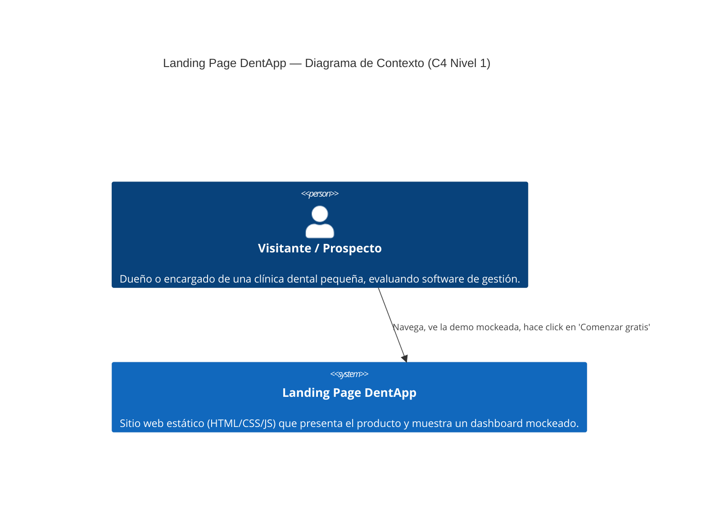

# C4 Nivel 1 — Diagrama de Contexto

## Qué es este diagrama
El Nivel 1 de C4 muestra el sistema como una **caja negra**: quién lo usa
(personas) y con qué otros sistemas interactúa, sin entrar en tecnología
ni en piezas internas. Es la vista de más alto nivel — responde
"¿qué es esto y quién lo toca?", no "¿cómo está construido por dentro?".

## Diagrama

## Por qué el diagrama es tan simple

- **Un solo actor.** El visitante/prospecto. No hay persona "administrador"
  ni "soporte" porque el sitio no tiene backend ni panel real — es
  puramente informativo/comercial.
- **Un solo sistema, sin sistemas externos.** No aparece ninguna API,
  base de datos ni servicio de terceros porque:
  - El sitio es 100% estático (ver [ADR 0001](../adr/0001-stack-vanilla-sin-build-tools.md)).
  - Los CTAs "Comenzar gratis" hoy son placeholders (`href="#"`) — todavía
    no están conectados a un formulario, CRM o pasarela de registro real.
  - El dashboard mockeado (próximo prototipo) es contenido estático
    servido por el mismo sitio, no una integración con el producto real
    de DentApp — el producto real queda fuera del alcance de este
    repositorio.
- **El MCP server queda fuera a propósito.** `mcp-server/` es una
  herramienta de tiempo de desarrollo que usa Claude Code para generar
  secciones (ver [ADR 0003](../adr/0003-mcp-server-para-tokens-y-scaffolding.md)).
  El visitante nunca interactúa con él en runtime, así que no pertenece
  a un diagrama de contexto — ese tipo de tooling se documenta aparte,
  no como parte del sistema que ve el usuario final.

## Para la presentación

Preguntas que este diagrama anticipa y ya tiene respuesta:

- *"¿Por qué no hay API ni base de datos?"* → el sitio es estático por
  decisión documentada (ADR 0001), no por una omisión.
- *"¿Dónde entra Claude Code / MCP en la arquitectura?"* → es tooling de
  desarrollo, fuera del contexto de runtime; está documentado en su
  propio ADR.
- Deja planteado el Nivel 2: ahí se abre la caja negra "Landing Page
  DentApp" en sus piezas internas (HTML, CSS, scripts JS, y el nuevo
  dashboard mockeado).
