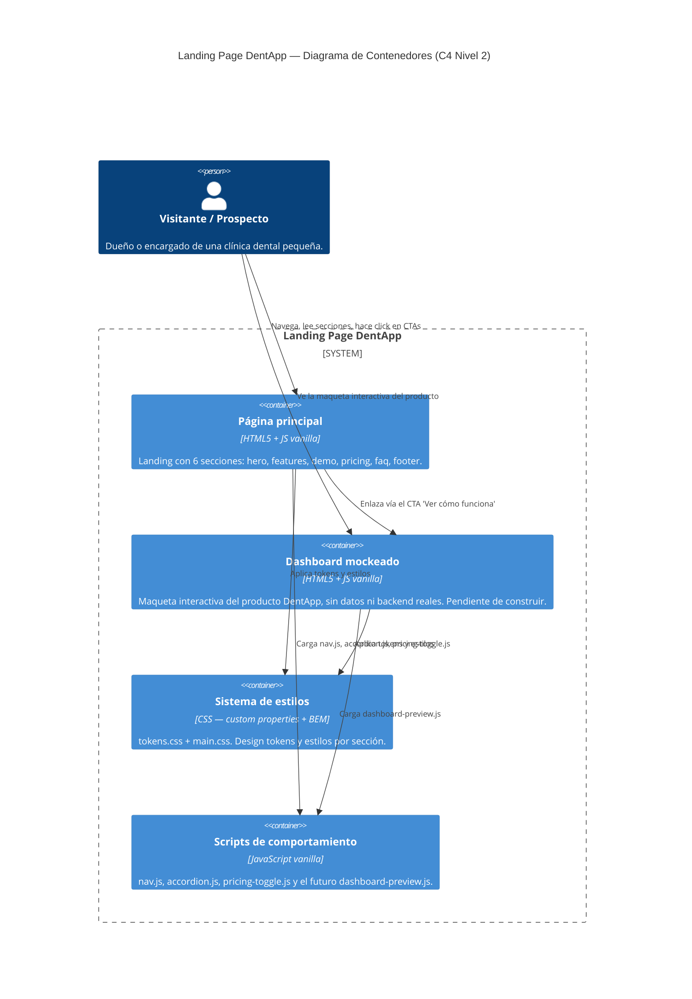

# C4 Nivel 2 — Diagrama de Contenedores

## Qué es este diagrama
El Nivel 2 abre la caja negra del Nivel 1 ("Landing Page DentApp") y
muestra sus **contenedores**: las piezas técnicas de alto nivel que la
componen (páginas, hojas de estilo, capas de scripts). Sigue sin bajar a
funciones o clases individuales — eso sería Nivel 3 (Componentes), que
este proyecto no necesita por su tamaño.

Este diagrama documenta la arquitectura **antes** de construir el
dashboard mockeado — funciona como plano de implementación, no como
descripción de algo ya terminado. `dashboard-preview.html` y
`dashboard-preview.js` todavía no existen en el repo; el diagrama es lo
que guía cómo se van a crear. El ADR con la decisión más importante de
este prototipo se escribe en el próximo paso, apoyándose en este mismo
diagrama.

## Diagrama

## Por qué estos contenedores y no otros

- **Página principal vs. Dashboard mockeado como contenedores separados.**
  Son dos documentos HTML distintos, navegables por separado, cada uno
  con su propio ciclo de vida — encaja con la definición de "contenedor"
  de C4 (unidad desplegable/ejecutable de forma independiente), aunque
  acá "desplegable" signifique simplemente "un archivo HTML servido
  aparte".
- **Sistema de estilos como contenedor propio**, no repartido dentro de
  cada página. Refleja una decisión real ya tomada
  ([ADR 0002](../adr/0002-bem-y-tokens-separados-de-estilos.md)):
  tokens y estilos viven separados del HTML y se comparten entre páginas.
- **Scripts de comportamiento agrupados en un solo contenedor lógico.**
  Son varios archivos (`nav.js`, `accordion.js`, etc.) pero cumplen el
  mismo rol arquitectónico — interactividad de UI sin dependencias — y
  separarlos uno por uno bajaría al detalle de Nivel 3, que no aporta a
  esta vista.
- **Sin contenedor de backend/API/base de datos.** Coherente con el
  Nivel 1: el sitio es estático de punta a punta
  ([ADR 0001](../adr/0001-stack-vanilla-sin-build-tools.md)). El
  dashboard mockeado no rompe esto — sus datos van a estar hardcodeados
  en el propio HTML/JS, no servidos desde ningún lado.
- **MCP server, otra vez fuera.** Por la misma razón que en Nivel 1: es
  tooling de desarrollo (Claude Code lo usa para generar secciones), no
  un contenedor que el visitante ejecuta o consume en runtime
  ([ADR 0003](../adr/0003-mcp-server-para-tokens-y-scaffolding.md)).

## Para la presentación

- Este diagrama es el que justifica la próxima decisión de arquitectura
  (el ADR de "dashboard mockeado sin datos ni backend") — se puede
  presentar como "primero dibujamos esto, después decidimos y recién
  ahí programamos", mostrando proceso de arquitectura real y no
  documentación hecha después de programar.
- Si preguntan "¿por qué no está roto en más piezas (Nivel 3)?" → porque
  el tamaño del proyecto no lo justifica; C4 recomienda parar en el
  nivel que siga siendo útil, y acá Nivel 2 ya cubre toda la superficie
  relevante para tomar decisiones.
